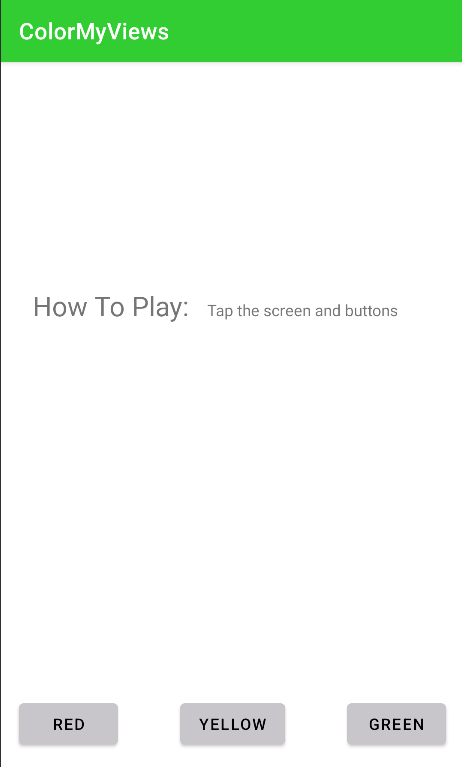
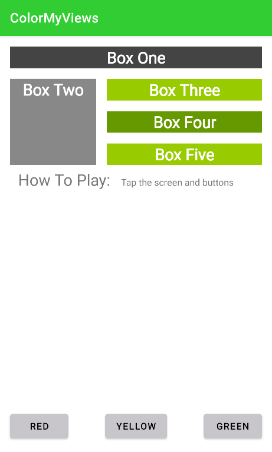
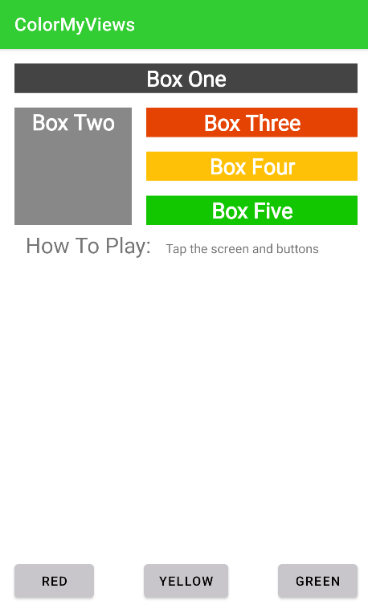

# ColorMyViews
The ColorMyViews app is a demo game app that lets users click to color boxes and the background.

This app demonstrates the following views and techniques:

- Using the Layout Editor to create layout
- In the Layout Editor: Creating chains, aligning objects, using baseline alignment for labels

## Screenshots
 
 
 
